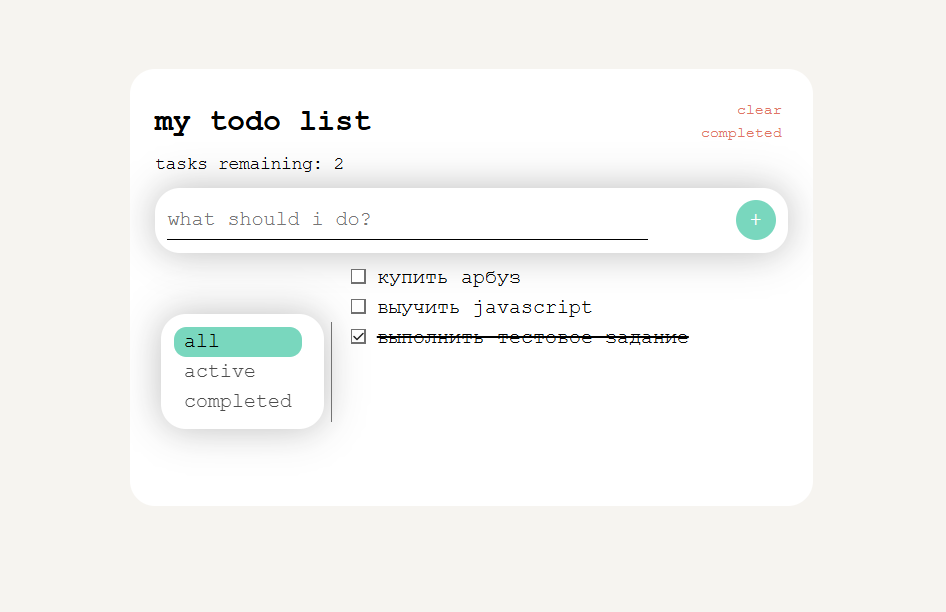

# my todo list
небольшое приложение для управления списком задач на React + Typescript + Zustand  
тестирование выполнено с помощью React Testing Library + Jest

---



## функциональность
- добавление новых задач
- установка/снятие отметки "выполнено/невыполнено"
- фильтр по статусу выполнения (все, активные, завершенные)
- подсчет количества активных задач
- очистка выполненных задач

---

## запуск
```bash
установка зависимостей: npm i  
запуск приложения: npm run start
запуск тестов: npm test